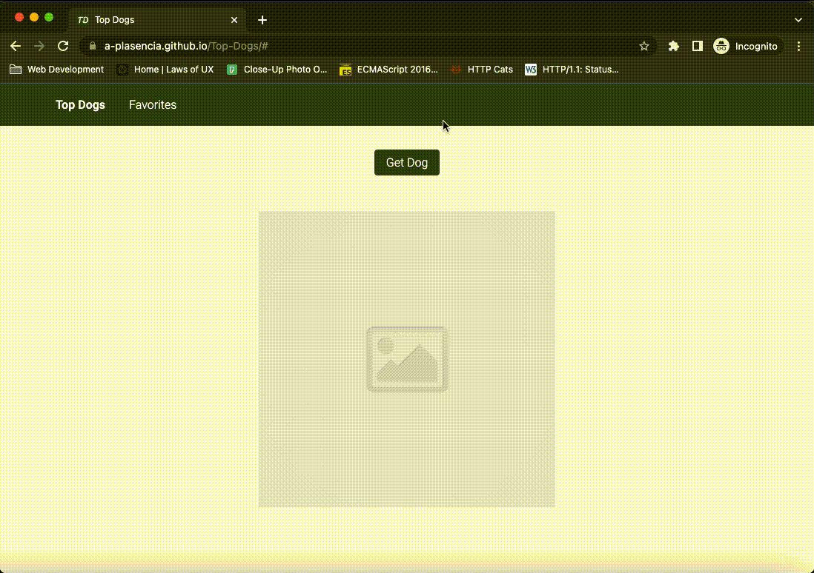

# Top Dogs

A dynamic HTML, CSS, and JavaScript solo project.

## Technologies Used

- HTML5
- CSS3
- JavaScript

## Preview



## Live Demo

Try the application live at [https://a-plasencia.github.io/Top-Dogs/#](https://a-plasencia.github.io/Top-Dogs/#)

## Features

- User can generate three random photos of dogs
- User can see the name of the dog's breed.
- User can favorite a dog picture that they like
- User can view the list of dogs that they favorite
- User can remove a dog from their favorites list

## Stretch Features

- User can upload pictures of their own dogs
- User can click on the breed name and it will link you to the corresponding dog breed's Wikipedia page

### Getting Started

1. Clone the repository

    ```shell
    git clone git@github.com:<you>/Top-Dogs.git
    cd top-dogs
    ```

2. Open index.html
